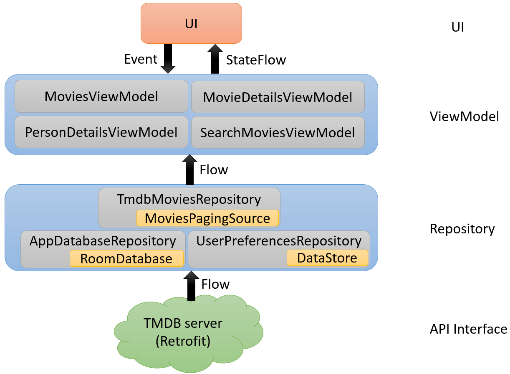

# My Movies

An Android app sample with Jetpack Compose in MVVM architecture. This app fetches movie data from [The Movie Database](https://www.themoviedb.org/) (a.k.a. [TMDB](https://www.themoviedb.org/)) API and displays movies information.


## Features

Browse movies (trending, top-rated, popular...), posters, backdrops, people's profile, images, and search for movies.

The language of the movie data from the TMDB server depends on your device's settings; therefore, the movie's content will be updated accordingly.

## Download

Latest released apk: [my-movies-v1.2.0.apk](https://github.com/neilchennc/my-movies/releases/download/v1.2.0/my-movies-v1.2.0.apk)

## Build

Before building the project, you have to register on [TMDB](https://www.themoviedb.org/) for an [API key](https://www.themoviedb.org/settings/api), and you will find an API access token in your account settings page.

After that, add the following line into **local.properties** file, and replace with your TMDB access token:

```properties
tmdb.access_token="YOUR_TMDB_ACCESS_TOKEN"
```

> *Note: The local.properties file is created by Android Studio IDE when you open the project.*

> *Recommended upgrading to the latest stable Android Studio and enabling K2 mode.*

## Architecture



## Techniques

- **Jetpack Compose** - Android’s recommended modern toolkit for building native UI.

- **Material Design** - Color and style theming.

- **Hilt** - The dependency injection library.

- **Coil** - Load images from the network library.

- **Retrofit** - HTTP API requests library.

- **Paging library** - Load and display pages of data from a network.

- **Shape** - Custom shapes in compose.

- **Type-Safe Navigation** - Navigating between screens with type-safe.

- **ViewModel** - Part of MVVM architecture. ViewModel is response for keeping data during configuration changes, handling business logic, exposing state to UI, and handling UI events.

- **DataStore** - Store user's preferences.

- **Room** - SQLite database library.

- **Kotlin Coroutines and Flows**

- **Timber** - A tiny log library.

- **Zoomable** - Compose multiplatform library that enables the content to be zoomable by gestures.

- **MockK** - Mocking library for Kotlin.

- **MockWebServer** - A scriptable web server for testing HTTP clients.

- **Truth** - Fluent assertions for testing.

- **Turbine** - Testing library for Kotlin Flows.
